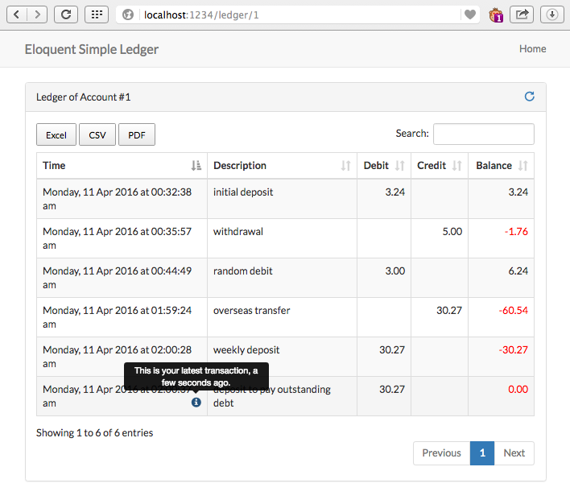

# Simple Ledger Mechanism via Laravel Eloquent

>debit, credit & balance are all integers by default.

### Record new debit 

	$amount  = 50;
	$desc    = 'initial deposit';
	$account = Account::find($your_account_id);
	$account->ledger->debit($amount, $desc);

Above code will create new row in `account_ledgers` table where `account_id` column is `$your_account_id`, `debit` column is `$amount` and `desc` column is `$desc`. The `balance` column will be summation of `balance` of previous row and `$amount`.

### Record new credit

	$amount  = 500;
	$desc    = 'rent payment';
	$account = Account::find($your_account_id);
	$account->ledger->credit($amount, $desc);

Above code will create new row in `account_ledgers` table where `account_id` column is `$your_account_id`, `credit` column is `$amount` and `desc` column is `$desc`. The `balance` column will be summation of `balance` of previous row and `-($amount)`.

### Get account balance

	$account = Account::find($your_account_id);
	$account->balance;

### Get Last (Previous) Balance

	$account = Account::find($your_account_id);
	$account->ledger->last_balance;

### Get Ledger Records

	$account = Account::find($your_account_id);
	$account->ledger->all();

### Behind The Scene

When a transaction happens, eloquent will create new row in `account_ledgers` table. If the transaction is debit, the `debit` column won't be null but the `credit` column will be, and vice versa. Then, it will get value of `balance` column from previous row (where the `account_id` is same as the `account_id` of new row) and add amount of transaction to get the balance of current transaction.

After the transaction finished, eloquent will cache the last balance of `account_ledgers` table in `accounts` table.

### Table Definitions

Table `accounts` :

- (int) id  
  id of account
- (int) balance  
  current balance of account

Table `account_ledgers` :

- (int) id
- (int) account_id
- (int) debit  
  amount of debit, nullable.

- (int) credit  
  amount of credit, nullable.
- (text) desc  
	description of transaction, nullable.
- (int) balance   
	sum of previous balance and current transaction. this column ensures we have balance of a transaction of any time.

Table `account_ledgers` contains transactions from all accounts in table `accounts`. Both tables have `balance` column, but with different usage.

`balance` in `account_ledgers` records new balance after every transaction. 

*Example Debit* : if balance of last row is 50 and current row's debit is 10, then the balance of current row will be 50 + 10 = 60.

*Example Credit* : if balance of last row is 60 and current row's credit is 20, then the balance of current row will be 60 + -(20) = 40.

Since balance of every transaction is recorded in `account_ledgers`, generating report (eg. bank-statement) will be easier.

The `balance` column in table `accounts` used to get balance of particular account, which is actually value of `balance` of last row in table `account_ledgers` of that particular account. This is to avoid querying whole rows in `account_ledgers` just to get balance of an account.

All rows in table `account_ledgers`	 are meant to be read-only data. A row can only be created, update or modification should not be processed.

### Integrating with User Model
Say, you want to get balance of currently logged in user, which might be something like this:

	auth()->user()->account->balance;

you need to connect your user model with account model.

*First, make sure the column `account_id` is available in table of your user model and it contains id of account that belongs to the user.*

*Secondly, add eloquent relationship in your user model:*

	
	// user model
	public function account(){
		return $this->hasOne(Wzulfikar\EloquentSimpleLedger\Account::class);	
	}

### Migration
Copy files in package's migrations folder into your laravel's migrations folder and run `php artisan migrate`. 

If you don't want to copy thus files into your app's migration folder, pass the path to package's migration files in artisan migrate command. Like this:
`php artisan migrate --path=vendor/wzulfikar/eloquent-simple-ledger/migrations`

### How it Looks
To see how it looks, 

- include package's `routes.php` into your app's `routes.php` :  
	`require_once base_path('path/to/wzulfikar/eloquent-simple-ledger/routes.php');`
- create dummy data for `account` and `account_ledgers` and then visit `/ledger/{account_id}`.

The sample view included some features:

 - export to excel, csv & pdf
 - reloading data using ajax
 - indicator for latest transaction
 - readable time via moment.js
 - responvie table, sortable columns & searchable -- yes, it uses datatables :)